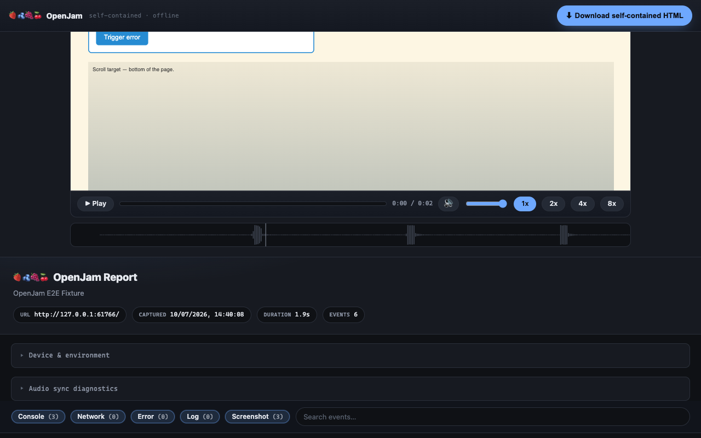
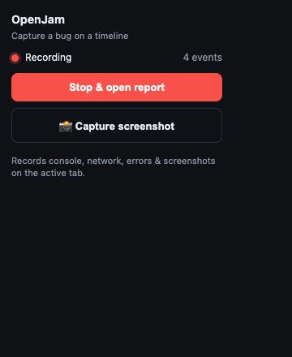
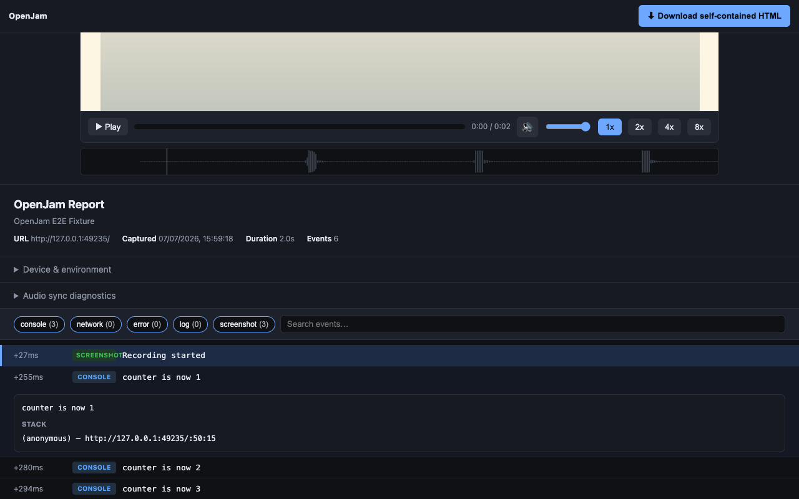

# 🍓🫐🍇🍒 OpenJam

[](https://claude.com/claude-code)

An open-source take on [Jam.dev](https://jam.dev): a Chrome extension that captures
**console logs, network requests, JS errors, screenshots, device/environment info, and a
full DOM session replay** ([rrweb](https://github.com/rrweb-io/rrweb)) onto a single
correlated timeline, then exports a **self-contained HTML bug report** — open it offline
and watch the session play back.

No backend, no account, no telemetry. Everything stays on your machine
([privacy policy](PRIVACY.md)).



<p>
  
  
</p>

Screenshots are generated, not hand-taken — `npm run screenshots` drives the real
extension over the deterministic e2e fixture with [Playwright](https://playwright.dev/docs/chrome-extensions)
and regenerates `docs/screenshots/`, so they always match the current code. Icons are
generated too: `npm run icons` composes the jammable-fruit logo (🍓🫐🍇🍒 — Unicode has no
raspberry or blackberry, blueberries stand in) from
[Microsoft Fluent Emoji](https://github.com/microsoft/fluentui-emoji) 3D art (MIT),
fetched once via [Iconify](https://iconify.design) and vendored in `assets/iconify/`.

## Build (required once)

rrweb must be bundled into the extension — MV3 forbids loading remote code
([Chrome docs](https://developer.chrome.com/docs/extensions/develop/migrate/improve-security)):

```sh
npm install
npm run build   # bundles dist/rrweb-recorder.js + generates src/generated/player-assets.js
```

## How it works

OpenJam attaches the [Chrome DevTools Protocol](https://chromedevtools.github.io/devtools-protocol/)
(`chrome.debugger`) to the active tab — the same mechanism DevTools itself uses — and listens to:

| Source | CDP domain | What you get |
|---|---|---|
| Console | `Runtime.consoleAPICalled` | log/info/warn/error messages + stack traces |
| Errors | `Runtime.exceptionThrown` | uncaught exceptions with stack + source location |
| Network | `Network.*` | method, URL, status, headers, payloads, timing, size, response bodies (text, <100 KB) |
| Browser log | `Log.entryAdded` | browser-level warnings |
| Screenshots | `Page.captureScreenshot` | at start/stop, on every error, and on demand |
| Environment | `Runtime.evaluate` | UA, platform, viewport, screen, timezone, memory |

Every event is normalised to a wall-clock timestamp so the report renders one ordered,
filterable timeline.

## Install (unpacked)

1. Open `chrome://extensions`.
2. Enable **Developer mode** (top right).
3. Click **Load unpacked** and select this `openjam/` folder.
4. Pin OpenJam from the extensions menu.

## Use

1. Go to the page with the bug.
2. Click the OpenJam icon → **Start recording**. Chrome shows a "being debugged" banner — that's the CDP attachment; leave it.
3. Reproduce the bug. Hit **📸 Capture screenshot** at key moments if you want extra frames.
4. Click **Stop & open report**. A new tab opens with the session replay on top and the timeline below.
5. Click **⬇ Download self-contained HTML** to save a shareable file (replay included).

## Report viewer

- Filter by type (console / network / error / log / screenshot).
- Full-text search across titles and payloads.
- Click any row to expand: headers, request/response bodies (pretty-printed JSON), stack traces, full screenshots.

## Development

Dev → build → test loop:

```sh
git clone https://github.com/SaintPepsi/openjam.git && cd openjam
npm install        # pinned deps: rrweb@2.0.1, @rrweb/replay@2.0.1, esbuild
npm run build      # see "When to rebuild" below
npm test           # bun unit suite (memory behaviors, export safety, issue links)
npm run test:e2e   # Playwright end-to-end suite (real extension, headless)
```

Then load the extension: `chrome://extensions` → Developer mode → **Load unpacked** →
this folder. After each code change: rebuild (if needed), click the **↻ reload** icon on
the OpenJam card, and reload the target page (so the content script re-injects).

**When to rebuild (`npm run build`):**

| You changed | Rebuild? | Why |
|---|---|---|
| `src/rrweb-recorder.js` | **Yes** | esbuild bundles it (+rrweb) into `dist/rrweb-recorder.js` |
| rrweb / @rrweb/replay versions | **Yes** | regenerates the bundle and `src/generated/player-assets.js` |
| `background.js`, `popup.*`, `viewer.*`, `renderer.js`, `report-builder.js` | No | loaded directly by the extension — just reload it |
| `manifest.json` | No | reload the extension |

`dist/` and `src/generated/` are build outputs (gitignored) — a fresh clone won't load
until you run `npm run build` once.

**Testing:** `npm test` runs the [Bun](https://bun.sh) unit suite in `test/` — recorder
buffer drainage, orphaned-recorder stop, session isolation, storage-quota degradation,
export size/escaping bounds, issue-link prefills. `npm run test:e2e` runs the
[Playwright](https://playwright.dev/docs/chrome-extensions) end-to-end suite in `e2e/`
(`npx playwright install chromium` once): it loads the real unpacked extension headless,
records the deterministic fixture (`test/e2e/fixture.html`), and asserts console/network/
screenshot rows land on the timeline, the replay plays back to the fixture's final state
(passwords masked), the downloaded export replays fully offline, restricted `chrome://`
pages fail with a reportable error, and storage keeps only the newest report. Shared
driving helpers live in `test/e2e/harness.mjs` — the screenshot generator uses the same
ones.

## Files

| File | Role |
|---|---|
| `manifest.json` | MV3 manifest |
| `background.js` | Capture engine — CDP attach, event routing, rrweb orchestration, report assembly |
| `src/rrweb-recorder.js` | Content-script session recorder (bundled to `dist/rrweb-recorder.js`) |
| `build.mjs` | esbuild: bundles the recorder, generates `src/generated/player-assets.js` |
| `report-builder.js` | Generates the self-contained HTML export (timeline + replay player) |
| `renderer.js` | Shared timeline renderer (extension page + embedded in exports) |
| `popup.html` / `popup.js` | Start/stop/screenshot controls |
| `viewer.html` / `viewer.js` | Renders the report and handles file export |
| `icons/` | Extension icons, generated by `npm run icons` |
| `assets/iconify/` | Vendored Fluent Emoji SVGs (MIT) the icons are built from |
| `scripts/` | Asset generators: `screenshots.mjs`, `icons.mjs` (Playwright) |
| `docs/screenshots/` | Generated store/README screenshots |
| `test/` | Bun test suite |
| `plans/` | Verified phase plans + MVP plan; `REPLAY_DESIGN.md` is the architecture |

## Session replay

While recording, an rrweb recorder (content script, `src/rrweb-recorder.js`) captures the
DOM and its mutations. The replay plays in the in-extension report page AND in the
exported HTML — scrubbable, offline, no dependencies. Replay uses rrweb defaults
(passwords masked; other inputs visible).

Playback is [@rrweb/replay](https://www.npmjs.com/package/@rrweb/replay)'s `Replayer`
driven by OpenJam's own controller (`mountReplay` in `renderer.js`). We don't use
`rrweb-player`: its 2.x dist builds ship without the code that constructs the Replayer
(verified across the 2.0.0/2.0.1 UMD and ESM artifacts — the player shell mounts but no
replay iframe is ever created), and `build.mjs` bundles the engine directly instead.

## Known limitations (v0.2.0 — MVP, see plans/MVP_PLAN.md for the cut list)

- Console/network history before **Start** is not captured — recording is forward-only.
- Response bodies are captured only for text-like types under 100 KB (configurable via `BODY_CAPTURE_MAX_BYTES` in `background.js`).
- Replay events are held in memory uncompressed — keep captures short (minutes, not hours). The manifest requests [`unlimitedStorage`](https://developer.chrome.com/docs/extensions/reference/api/storage#storage_areas), so the ~10 MB `chrome.storage.local` quota doesn't apply; if a save still fails (disk pressure), the report degrades in layers: replay dropped (noted on the timeline), then screenshot pixels.
- Only the most recent report is kept in extension storage (quota); download the HTML to keep a capture.
- Canvas/WebGL, video frames, and cross-origin iframes replay imperfectly (DOM replay, not pixels — see `plans/PHASE_3_PLAN.md`).
- Images may not render in offline replay (rrweb `inlineImages` default off); structure and text replay faithfully.
- Chromium-only (Chrome, Vivaldi, Edge, Brave), **Chrome ≥118 required**: from 118 an active `chrome.debugger` session keeps the background service worker alive for the whole recording ([SW lifecycle docs](https://developer.chrome.com/docs/extensions/develop/concepts/service-workers/lifecycle)); on older versions a long idle recording can be evicted. Firefox/Safari need the injection pivot in `plans/PHASE_4_PLAN.md`.

## Roadmap (researched & verified plans in plans/)

- `PHASE_1_PLAN.md` — bounded ring buffer + IndexedDB for long sessions, in-extension player
- `PHASE_2_PLAN.md` — compressed exports (fflate) for large captures
- `PHASE_3_PLAN.md` — hybrid CDP pixel keyframes for canvas/WebGL/cross-origin
- `PHASE_4_PLAN.md` — Firefox/Safari via injection-based capture
- Audio capture (tab audio / mic narration) on the timeline — requested by first users

## Reporting OpenJam bugs

When OpenJam itself fails (not the page you're recording — that's the product working),
the popup and report viewer show a **Report this on GitHub →** link that pre-fills an
issue with the error, extension version, and browser UA — nothing else. Issues are
public: **remove any PII** (names, emails, internal URLs, tokens) before submitting.

## License

[GPL-3.0-or-later](LICENSE) — free to use, modify, and redistribute; copies and
derivatives must remain open source under the same terms. The vendored
[Fluent Emoji](https://github.com/microsoft/fluentui-emoji) SVGs in `assets/iconify/`
are MIT (GPL-compatible).
